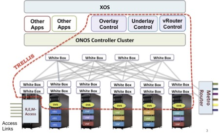

## OpenCord

如果网络设备的一些硬件逐渐被软件取代，那么，理所当然的，我们传统的中心机房也将会变成小型数据中心。CORD就是为此而生。
CORD，全称Central Office Re-architected as a Datacenter，重构中心机房为数据中心，旨在利用SDN/NFV、云计算使能网络更低成本和更敏捷。
CORD的主要支持者有AT&T，SK电信，中国联通和NTT等。它是开放网络操作系统ONOS项目的一个应用案例，致力于将已有的开源和商用部件整合应用于实际场景。
根据运营商网络组成和应用场景，CORD分为三大部分：M-CORD、R-CORD和E-CORD。

● R(Residential)-CORD ：面向家庭住宅场景

● M(mobile)-CORD：面向4G/5G移动网络

● E(Enterprise)-CORD：面向政企用户场景

正如ONOS （开放网络操作系统 http://onosproject.org）上所介绍的，CORD（central office re-architected as a datacenter）和packet optical（分组光网）是ONOS项目的两大应用场景。

电信运营商面临着日益增长的带宽和敏捷的服务需求。他们既要应付目前的数据爆炸性增长对带宽的需求，同时又要开拓新的服务领域，甚至为未达到的地区增设新的光纤。但是，居于目前的传统技术，去应付这些需求，运营商往往需求数月才能引进一个新的服务，有些服务的引入更是长达一年甚至数年。
相比电信领域，在目前的企业数据中心，在云计算技术的帮助下，IT 服务提供商却能享受新服务的快速上线和资源的伸缩部署。
为了能够享受云计算、SDN和NFV提供的便捷性，电信局端的机房中的专有设备及其互联技术必须得以更新，也就是CORD重新架构。

CORD的核心理念是：
结合SDN，NFV和弹性云服务，分解专有设备，充分利用通用的硬件，打造高效、敏捷的网络，降低CAPEX和OPEX，并提高服务上线能力。

重构电信局端，主要以下面三个技术为中心：
	1. 软件定义网络 （SDN）。软件定义网络的核心之一是分离控制平面和转发平面。分离出来的控制平面支持可编程，从而提高控制平面的创新。转发平面和控制平面剥离开之后，变得相对简单，能够采用普通商用的芯片，向通用、便宜的白盒设备发展。
	2. 网络功能虚拟化（NFV）。由SDN分离出来的控制平面可以进一步从硬件向软件方向进化。这可以在通用的设备上运行多个转发功能，并且软件化的数据平面有利于创新和规模化部署。
	3. 云技术（openstack）。云技术等效于弹性和规模化。利用云技术，运营商能够利用微服务、虚拟化、弹性伸缩等信息系统设计元素来做业务创新。

简言之，CORD要重构电信局端，不仅要用更加敏捷的软件、通用的硬件来替换掉专有的设备，还要让局端成为电信运营商云战略的有机组成部分，为业务创新提供强有力的保障。

CORD中的Trellis是实现CORD系统网络互联的软硬件设施。它既包括SPINE-LEAF架构及其控制器-underlay控制器，也包括为CORD网元提供虚拟网络的Overlay控制器，还有为CORD和外部系统联系的vRouter控制软件。

电信服务重构步骤
有了上面的软硬架构，重构局端分为两步：
	1. 虚拟化网元
 	   网元的虚拟化就是要把运行在专用设备中的网络功能，变成软件，转移到通用的硬件上运行。我们需要分解和重构传统网元上的功能，决定控制平面和数据平面及其分界线。

	2. 提供软件框架。

    一个可以让虚拟化的网元接入的软件服务框架是局端重构的关键。上面我们提到的软件堆栈就是这样一套框架。