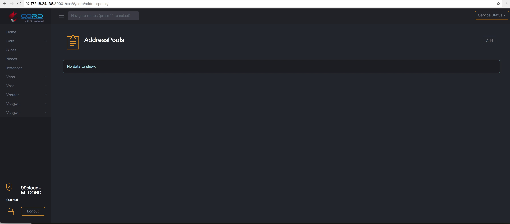

## 部署opencord

### 使用helm部署xos-core
Install XOS core containers

```
# down cord helm code
[root@os-k8s-1 helm-charts]# git clone https://gerrit.opencord.org/helm-charts

# install xos core

[root@os-k8s-1 helm-charts]# helm install -f examples/test-values.yaml -n xos xos-core/

[root@os-k8s-1 helm-charts]# kubectl get pod
NAME                             READY     STATUS    RESTARTS   AGE
hello-nginx                      1/1       Running   1          7d
xos-chameleon-785c49c66b-5rnwq   1/1       Running   0          19m
xos-core-6dbd6cd4d4-hx4jp        1/1       Running   0          19m
xos-db-566dd8c6f9-5h7j8          1/1       Running   0          19m
xos-gui-745f8878d4-x95zh         1/1       Running   0          13m
xos-redis-5cf77fd49f-q4l6f       1/1       Running   0          19m
xos-tosca-58d6dd9f9b-wf8lv       1/1       Running   0          19m
xos-ws-67cff6bbfd-9wm88          1/1       Running   0          13m 

```
### 访问xos-gui

xos-gui可以通过nodeport进行访问, 例如 http://ip:30001/xos/#/dashboard
```
# 查看gui访问端口
[root@os-k8s-1 helm-charts]# kubectl get svc
NAME                  TYPE        CLUSTER-IP      EXTERNAL-IP   PORT(S)               AGE
hello-nginx-service   NodePort    10.68.180.199   <none>        80:30080/TCP          7d
kubernetes            ClusterIP   10.68.0.1       <none>        443/TCP               40d
redis                 ClusterIP   10.68.221.171   <none>        6379/TCP              25m
xos-chameleon         NodePort    10.68.227.162   <none>        9101:30006/TCP        25m
xos-core              ClusterIP   10.68.73.60     <none>        50051/TCP,50055/TCP   25m
xos-db                ClusterIP   10.68.48.94     <none>        5432/TCP              25m
xos-gui               NodePort    10.68.126.134   <none>        4000:30001/TCP        19m
xos-tosca             NodePort    10.68.202.189   <none>        9102:30007/TCP        25m
xos-ws                NodePort    10.68.172.146   <none>        3000:30008/TCP        19m
```




### 修改xos默认密码

```
[root@os-k8s-1 helm-charts]# cat adminpassword.yaml

# Override XOS admin user and password values set in values.yaml
#
# helm install -f examples/adminuser-values.yaml xos-core -n xos-core
# helm install -f examples/adminuser-values.yaml xos-profiles/rcord-lite -n rcord-lite

xosAdminUser: &adminuser "admin"
xosAdminPassword: &adminpass "test"

[root@os-k8s-1 helm-charts]# helm install -f adminpassword.yaml xos-core -n xos-core

```
