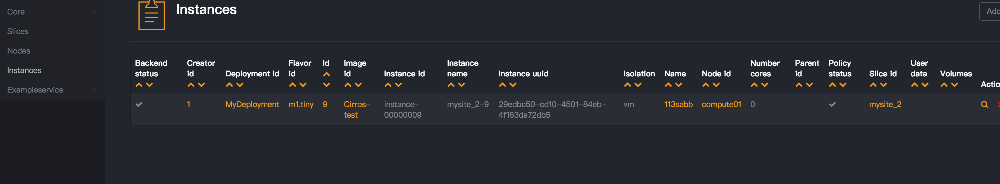
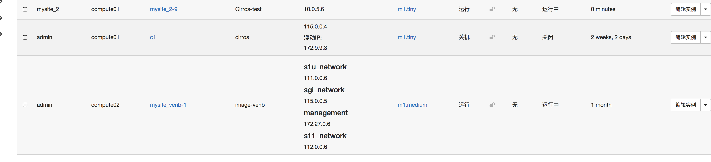

### xos对接openstack

目标：在xos创建网络，虚拟机 能同步到openstack平台


初始化 Images and flavors, Deployment，openstack controller等

```
[root@os-k8s-1 base-openstack]# cat  test.yaml
tosca_definitions_version: tosca_simple_yaml_1_0
imports:
  - custom_types/onosservice.yaml
  - custom_types/onosapp.yaml
description: onos services
topology_template:
      node_templates:

    # Images and flavors
        Ubuntu-14.04:
          type: tosca.nodes.Image
          properties:
            name: "Ubuntu 14.04 64-bit"
            disk_format: QCOW2
            container_format: BARE
            path: https://github.com/opencord/platform-install/releases/download/vms/trusty-server-cloudimg-amd64-disk1.img.20170201

        m1.tiny:
          type: tosca.nodes.Flavor
          properties:
            name: m1.tiny

        m1.small:
          type: tosca.nodes.Flavor
          properties:
            name: m1.small

        m1.medium:
          type: tosca.nodes.Flavor
          properties:
            name: m1.medium

        MyDeployment:
          type: tosca.nodes.Deployment
          properties:
            name: MyDeployment

        # OpenStack Controller
        mysite_MyDeployment_openstack:
          type: tosca.nodes.Controller
          requirements:
            - deployment:
                node: MyDeployment
                relationship: tosca.relationships.BelongsToOne
          properties:
              name: mysite_MyDeployment_openstack
              backend_type: OpenStack
              version: Pike
              auth_url: http://172.18.24.81//v3
              admin_user: admin
              admin_password: password
              admin_tenant: admin
              domain: Default

    # Site - adds openstack controller to site defined in deployment.yaml
        mysite:
          type: tosca.nodes.Site
          properties:
              name: mysite
              must-exist: true
              site_url: http://mysite.opencloud.us/
              hosts_nodes: true

        mysite_deployment_MyDeployment:
            type: tosca.nodes.SiteDeployment
            requirements:
                - site:
                    node: mysite
                    relationship: tosca.relationships.BelongsToOne
                - deployment:
                    node: MyDeployment
                    relationship: tosca.relationships.BelongsToOne
                - controller:
                    node: mysite_MyDeployment_openstack
                    relationship: tosca.relationships.BelongsToOne

        mysite_openstack_controller:
            type: tosca.nodes.ControllerSite
            requirements:
                - site:
                    node: mysite
                    relationship: tosca.relationships.BelongsToOne
                - controller:
                    node: mysite_MyDeployment_openstack
                    relationship: tosca.relationships.BelongsToOne

    # For creating a test VM
        mysite_test:
          description: Test Slice
          type: tosca.nodes.Slice
          properties:
            # network: noauto
            name: mysite_test
          requirements:
            - site:
                node: mysite
                relationship: tosca.relationships.BelongsToOne
            - default_image:
                node: Ubuntu-14.04
                relationship: tosca.relationships.BelongsToOne

    # For private networks (e.g., per-slice)
        private_template:
          type: tosca.nodes.NetworkTemplate
          properties:
            name: Private
            visibility: private
            translation: none
            vtn_kind: PRIVATE

    # management (vtn: MANAGEMENT_LOCAL) network
        management_template:
          type: tosca.nodes.NetworkTemplate
          properties:
            name: management_template
            visibility: private
            translation: none
            vtn_kind: MANAGEMENT_LOCAL

        management:
          type: tosca.nodes.Network
          properties:
            name: management
            # ip_version: 4
            subnet: 172.27.0.0/24
            permit_all_slices: true
          requirements:
            - template:
                node: management_template
                relationship: tosca.relationships.BelongsToOne
            - owner:
                node: slice#mysite_management
                relationship: tosca.relationships.BelongsToOne

    # Slice to own management networks
        slice#mysite_management:
          description: This slice exists solely to own the management network(s)
          type: tosca.nodes.Slice
          properties:
            network: noauto
            name: mysite_management
          requirements:
            - site:
                node: mysite
                relationship: tosca.relationships.BelongsToOne

    # Connect mysite_test to management net
        networkslice#management_to_mysite_test:
            type: tosca.nodes.NetworkSlice
            requirements:
              - network:
                  node: management
                  relationship: tosca.relationships.BelongsToOne
              - slice:
                  node: mysite_test
                  relationship: tosca.relationships.BelongsToOne

[root@os-k8s-1 base-openstack]# http POST http://127.0.0.1:30007/run xos-username:admin@opencord.org xos-password:letmein @./openstack.yaml





```