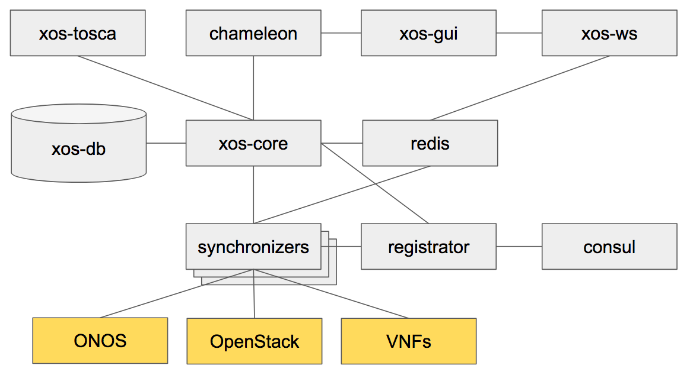

## xos

XOS，XOS是CORD中的顶层控制面，提供服务组合。它统一协调OpenStack、Docker，以及ONOS，打造新型服务上线模型。
网络互联的Trellis

XOS将一切即服务（XaaS）组织原则引入CORD架构。在此过程中，它解决了CORD的一些高级设计  需求，包括无缝集成基于控制平面（SDN）和数据平面（NFV）的服务的方法; 支持接入服务和传统云服务的能力; 支持多个安全域; 以及使CORD具有可扩展性和可控性的“端到端粘合剂”。

XOS是CORD的独立组件，它作为整个CORD的“控制器”。虽然它最初在CORD之外有生命，但它不是一个独立的开源项目 - 它是在CORD的项目管理下进行。

XOS由一组Docker容器组成，这些容器合作提供平台控制器功能，包括数据模型，同步器和北向API。以下是这些容器的清单:

|    name      | Description                           |Ports|
| ------------ | ------------------------------------- | ------------|
| xos-core     |  该平台的核心包含模型定义和xProto工具链    |50051,500515|
| xos-db       |  保持数据模型的Postgres实例              |	5432        |
| xos-redis    |  Redis实例，用作内部通知的发布/订阅渠道    |5432         |
| xos-tosca    |  北行(控制)TOSCA，可通过RESTapi访问/xos-tosca|9102     |
| xos-gui      |  北向GUI界面，可访问 /xos| 4000|
| xos-ws.      |  监听redis事件并通过Web套接字传播它们以进行通知|3000|
| xos-chameleon|  北向REST界面，可在/xosapi/v1/..（swagger发布于/apidocs/）|3000|

gRPC除了xos-guiREST和web-socket的组合以外， 容器之间之间通信如下图所示

注:(目前最新版本6.0.0 已经移除consul和registrator) 